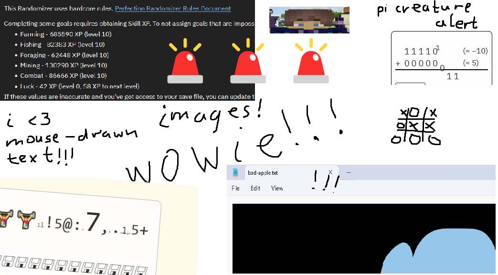

Not sure what I'll use it for, though. Probably explaining my projects.
Or just putting opinions on the internet ¯\\\_(ツ)\_/¯

It can format code blocks!
```c
#include <stdio.h>

int main() {
    puts("Hello, world!\n");
}
```

And even include assets like images!

