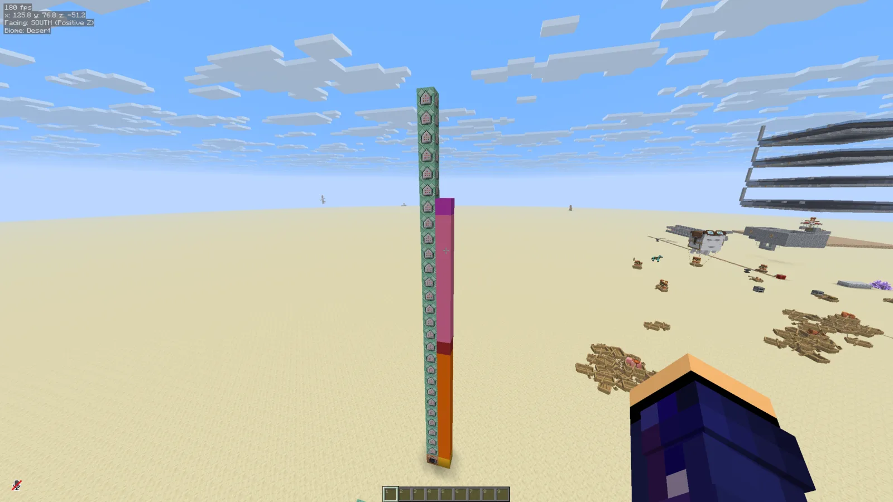
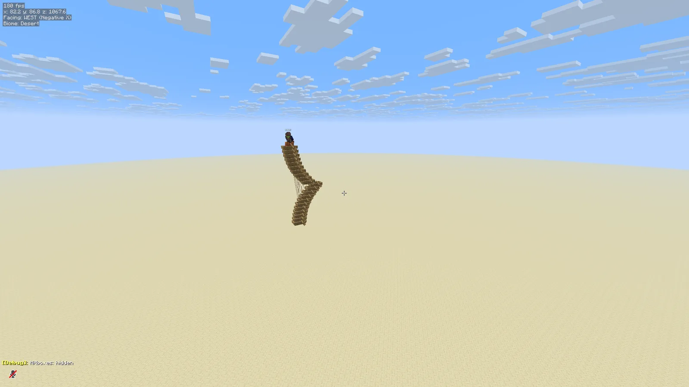

Recently [a new kind of flying machine](https://www.youtube.com/watch?v=M0vdu-UeVeA) was invented, that uses boats and leads to fly surprisingly quickly by abusing Minecraft's physics engine. I loved playing around with it, but thought it was hard to set up every time, so I decided to see if I can set up some commands to summon a boat stack automagically.

## The setup
The flying machine consists of 22 boats[^1] sitting on top of each other, aligned horizontally; 21 leads, and a saddled pig (riding the topmost boat). The bottom 11 boats are leashed to the top boat, and the top 10 boats are leashed to the bottom boat.

## Doing that with commands
Summoning boats is easy: `summon oak_boat`. I also give them tags to mark them as the top/bottom boat, as well as which one they need to be leashed to.

Leashing them is a tad trickier: I used the `data modify` command for this to directly inject the leash data. An entity stores what it's leashed to in its `leash` tag, which looks like `{leash:{UUID:[I;(4 ints)]}}`. Thankfully `data modify` supports copying data from another entity, so I grab the top/bottom boat's UUID and put it in `leash.UUID`.

Then, the boats are rotated to match the player. This is once again done with a `data modify` command, copying `@p` (the nearest player)'s `Rotation[0]` to the boats. Because the contraption flies in the OPPOSITE direction that the boats are facing, the player is first rotated 180 degrees with a `tp`, then the rotation is copied over, and then the player is rotated back. I found the boat stack works when pointed in any direction.

Lastly, a `ride` invocation puts the player on the pig, so the boat stack doesn't leave without them.

## Making it easy to use

The result of my work so far was a vertical stack of 28 command blocks. Their content is as follows (bottom to top):
```mcfunction
summon oak_boat ~3 ~5 ~ {Tags:["leash_to_top","anchor_bottom"]}
summon oak_boat ~3 ~4.5625 ~ {Tags:["leash_to_top"]}
summon oak_boat ~3 ~4.125 ~ {Tags:["leash_to_top"]}
summon oak_boat ~3 ~3.6875 ~ {Tags:["leash_to_top"]}
summon oak_boat ~3 ~3.25 ~ {Tags:["leash_to_top"]}
summon oak_boat ~3 ~2.8125 ~ {Tags:["leash_to_top"]}
summon oak_boat ~3 ~2.375 ~ {Tags:["leash_to_top"]}
summon oak_boat ~3 ~1.9375 ~ {Tags:["leash_to_top"]}
summon oak_boat ~3 ~1.5 ~ {Tags:["leash_to_top"]}
summon oak_boat ~3 ~1.0625 ~ {Tags:["leash_to_top"]}
summon oak_boat ~3 ~0.625 ~ {Tags:["leash_to_top"]}
summon oak_boat ~3 ~0.1875 ~ {Tags:[]}
summon oak_boat ~3 ~-0.25 ~ {Tags:["leash_to_bottom"]}
summon oak_boat ~3 ~-0.6875 ~ {Tags:["leash_to_bottom"]}
summon oak_boat ~3 ~-1.125 ~ {Tags:["leash_to_bottom"]}
summon oak_boat ~3 ~-1.5625 ~ {Tags:["leash_to_bottom"]}
summon oak_boat ~3 ~-2.0 ~ {Tags:["leash_to_bottom"]}
summon oak_boat ~3 ~-2.4375 ~ {Tags:["leash_to_bottom"]}
summon oak_boat ~3 ~-2.875 ~ {Tags:["leash_to_bottom"]}
summon oak_boat ~3 ~-3.3125 ~ {Tags:["leash_to_bottom"]}
summon oak_boat ~3 ~-3.75 ~ {Tags:["leash_to_bottom"]}
summon oak_boat ~3 ~-4.1875 ~ {Tags:["leash_to_bottom","anchor_top"],Passengers:[{id:"minecraft:pig",Tags:["boatstack_pig"],equipment:{saddle:{id:"minecraft:saddle",count:1}}}]}
execute as @e[tag=leash_to_top,distance=..20] run data modify entity @s leash.UUID set from entity @e[tag=anchor_top,limit=1,sort=nearest,distance=..30] UUID
execute as @e[tag=leash_to_bottom,distance=..20] run data modify entity @s leash.UUID set from entity @e[tag=anchor_bottom,limit=1,sort=nearest,distance=..30] UUID
execute at @p run tp @p ~ ~ ~ ~180 ~
execute as @e[type=oak_boat,distance=..30] run data modify entity @s Rotation[0] set from entity @p Rotation[0]
execute at @p run tp @p ~ ~ ~ ~180 ~
ride @p mount @e[tag=boatstack_pig,limit=1,sort=nearest,distance=..30]
```



I decided to compact it into a one-command contraption. These aren't anything extraordinary, although I did have to relearn how to make them :P

### Summon a boat-stack

Put this in an "Impulse" command block and activate it (with redstone or by setting it to "Always Active"). Make sure there's ample space above.

```mcfunction
summon falling_block ~ ~1.5 ~ {BlockState:{Name:"minecraft:stone"},Passengers:[{id:"minecraft:falling_block",BlockState:{Name:"minecraft:redstone_block"},Passengers:[{id:"minecraft:falling_block",BlockState:{Name:"minecraft:activator_rail"},Passengers:[
{id:"minecraft:command_block_minecart",Command:"summon oak_boat ~ ~2 ~ {Tags:[\"leash_to_top\",\"anchor_bottom\"]}"},
{id:"minecraft:command_block_minecart",Command:"summon oak_boat ~ ~2.5625 ~ {Tags:[\"leash_to_top\"]}"},
{id:"minecraft:command_block_minecart",Command:"summon oak_boat ~ ~3.125 ~ {Tags:[\"leash_to_top\"]}"},
{id:"minecraft:command_block_minecart",Command:"summon oak_boat ~ ~3.6875 ~ {Tags:[\"leash_to_top\"]}"},
{id:"minecraft:command_block_minecart",Command:"summon oak_boat ~ ~4.25 ~ {Tags:[\"leash_to_top\"]}"},
{id:"minecraft:command_block_minecart",Command:"summon oak_boat ~ ~4.8125 ~ {Tags:[\"leash_to_top\"]}"},
{id:"minecraft:command_block_minecart",Command:"summon oak_boat ~ ~5.375 ~ {Tags:[\"leash_to_top\"]}"},
{id:"minecraft:command_block_minecart",Command:"summon oak_boat ~ ~5.9375 ~ {Tags:[\"leash_to_top\"]}"},
{id:"minecraft:command_block_minecart",Command:"summon oak_boat ~ ~6.5 ~ {Tags:[\"leash_to_top\"]}"},
{id:"minecraft:command_block_minecart",Command:"summon oak_boat ~ ~7.0625 ~ {Tags:[\"leash_to_top\"]}"},
{id:"minecraft:command_block_minecart",Command:"summon oak_boat ~ ~7.625 ~ {Tags:[\"leash_to_top\"]}"},
{id:"minecraft:command_block_minecart",Command:"summon oak_boat ~ ~8.1875 ~"},
{id:"minecraft:command_block_minecart",Command:"summon oak_boat ~ ~8.75 ~ {Tags:[\"leash_to_bottom\"]}"},
{id:"minecraft:command_block_minecart",Command:"summon oak_boat ~ ~9.3125 ~ {Tags:[\"leash_to_bottom\"]}"},
{id:"minecraft:command_block_minecart",Command:"summon oak_boat ~ ~9.875 ~ {Tags:[\"leash_to_bottom\"]}"},
{id:"minecraft:command_block_minecart",Command:"summon oak_boat ~ ~10.4375 ~ {Tags:[\"leash_to_bottom\"]}"},
{id:"minecraft:command_block_minecart",Command:"summon oak_boat ~ ~11 ~ {Tags:[\"leash_to_bottom\"]}"},
{id:"minecraft:command_block_minecart",Command:"summon oak_boat ~ ~11.5625 ~ {Tags:[\"leash_to_bottom\"]}"},
{id:"minecraft:command_block_minecart",Command:"summon oak_boat ~ ~12.125 ~ {Tags:[\"leash_to_bottom\"]}"},
{id:"minecraft:command_block_minecart",Command:"summon oak_boat ~ ~12.6875 ~ {Tags:[\"leash_to_bottom\"]}"},
{id:"minecraft:command_block_minecart",Command:"summon oak_boat ~ ~13.25 ~ {Tags:[\"leash_to_bottom\"]}"},
{id:"minecraft:command_block_minecart",Command:"summon oak_boat ~ ~13.8125 ~ {Tags:[\"leash_to_bottom\",\"anchor_top\"],Passengers:[{id:\"minecraft:pig\",Tags:[\"boatstack_pig\"],equipment:{saddle:{id:\"minecraft:saddle\",count:1}}}]}"},
{id:"minecraft:command_block_minecart",Command:"execute as @e[tag=leash_to_top,distance=..15] run data modify entity @s leash.UUID set from entity @e[tag=anchor_top,limit=1,sort=nearest,distance=..15] UUID"},
{id:"minecraft:command_block_minecart",Command:"execute as @e[tag=leash_to_bottom,distance=..15] run data modify entity @s leash.UUID set from entity @e[tag=anchor_bottom,limit=1,sort=nearest,distance=..15] UUID"},
{id:"minecraft:command_block_minecart",Command:"execute at @p run tp @p ~ ~ ~ ~180 ~"},
{id:"minecraft:command_block_minecart",Command:"execute as @e[type=oak_boat,distance=..15] run data modify entity @s Rotation[0] set from entity @p Rotation[0]"},
{id:"minecraft:command_block_minecart",Command:"execute at @p run tp @p ~ ~ ~ ~180 ~"},
{id:"minecraft:command_block_minecart",Command:"ride @p mount @e[tag=boatstack_pig,limit=1,sort=nearest,distance=..15]"},
{id:"minecraft:command_block_minecart",Command:"setblock ~ ~-2 ~ command_block{Command:\"fill ~ ~-1 ~ ~ ~2 ~ air replace\",auto:1b} replace"},
{id:"minecraft:command_block_minecart",Command:"kill @e[type=command_block_minecart,distance=..2]"},
]}]}]}
```

### Give yourself a command-block with the above

Put this in an "Impulse" command block and activate it to give yourself a command block with the above command (as well as a custom name and description), which may simply be placed to instantly create a boat stack and ride it. You can also save the result in the creative menu by pressing C and a digit while it's in your hotbar.

```mcfunction
/give @p command_block[minecraft:custom_name={text:"Instant Boatstack",italic:false},minecraft:lore=[{text:"Just add leads!",color:gray,italic:false}],minecraft:block_entity_data={id:"minecraft:command_block",Command:'summon falling_block ~ ~1.5 ~ {BlockState:{Name:"minecraft:stone"},Passengers:[{id:"minecraft:falling_block",BlockState:{Name:"minecraft:redstone_block"},Passengers:[{id:"minecraft:falling_block",BlockState:{Name:"minecraft:activator_rail"},Passengers:[
{id:"minecraft:command_block_minecart",Command:"summon oak_boat ~ ~2 ~ {Tags:[\\"leash_to_top\\",\\"anchor_bottom\\"]}"},
{id:"minecraft:command_block_minecart",Command:"summon oak_boat ~ ~2.5625 ~ {Tags:[\\"leash_to_top\\"]}"},
{id:"minecraft:command_block_minecart",Command:"summon oak_boat ~ ~3.125 ~ {Tags:[\\"leash_to_top\\"]}"},
{id:"minecraft:command_block_minecart",Command:"summon oak_boat ~ ~3.6875 ~ {Tags:[\\"leash_to_top\\"]}"},
{id:"minecraft:command_block_minecart",Command:"summon oak_boat ~ ~4.25 ~ {Tags:[\\"leash_to_top\\"]}"},
{id:"minecraft:command_block_minecart",Command:"summon oak_boat ~ ~4.8125 ~ {Tags:[\\"leash_to_top\\"]}"},
{id:"minecraft:command_block_minecart",Command:"summon oak_boat ~ ~5.375 ~ {Tags:[\\"leash_to_top\\"]}"},
{id:"minecraft:command_block_minecart",Command:"summon oak_boat ~ ~5.9375 ~ {Tags:[\\"leash_to_top\\"]}"},
{id:"minecraft:command_block_minecart",Command:"summon oak_boat ~ ~6.5 ~ {Tags:[\\"leash_to_top\\"]}"},
{id:"minecraft:command_block_minecart",Command:"summon oak_boat ~ ~7.0625 ~ {Tags:[\\"leash_to_top\\"]}"},
{id:"minecraft:command_block_minecart",Command:"summon oak_boat ~ ~7.625 ~ {Tags:[\\"leash_to_top\\"]}"},
{id:"minecraft:command_block_minecart",Command:"summon oak_boat ~ ~8.1875 ~"},
{id:"minecraft:command_block_minecart",Command:"summon oak_boat ~ ~8.75 ~ {Tags:[\\"leash_to_bottom\\"]}"},
{id:"minecraft:command_block_minecart",Command:"summon oak_boat ~ ~9.3125 ~ {Tags:[\\"leash_to_bottom\\"]}"},
{id:"minecraft:command_block_minecart",Command:"summon oak_boat ~ ~9.875 ~ {Tags:[\\"leash_to_bottom\\"]}"},
{id:"minecraft:command_block_minecart",Command:"summon oak_boat ~ ~10.4375 ~ {Tags:[\\"leash_to_bottom\\"]}"},
{id:"minecraft:command_block_minecart",Command:"summon oak_boat ~ ~11 ~ {Tags:[\\"leash_to_bottom\\"]}"},
{id:"minecraft:command_block_minecart",Command:"summon oak_boat ~ ~11.5625 ~ {Tags:[\\"leash_to_bottom\\"]}"},
{id:"minecraft:command_block_minecart",Command:"summon oak_boat ~ ~12.125 ~ {Tags:[\\"leash_to_bottom\\"]}"},
{id:"minecraft:command_block_minecart",Command:"summon oak_boat ~ ~12.6875 ~ {Tags:[\\"leash_to_bottom\\"]}"},
{id:"minecraft:command_block_minecart",Command:"summon oak_boat ~ ~13.25 ~ {Tags:[\\"leash_to_bottom\\"]}"},
{id:"minecraft:command_block_minecart",Command:"summon oak_boat ~ ~13.8125 ~ {Tags:[\\"leash_to_bottom\\",\\"anchor_top\\"],Passengers:[{id:\\"minecraft:pig\\",Tags:[\\"boatstack_pig\\"],equipment:{saddle:{id:\\"minecraft:saddle\\",count:1}}}]}"},
{id:"minecraft:command_block_minecart",Command:"execute as @e[tag=leash_to_top,distance=..15] run data modify entity @s leash.UUID set from entity @e[tag=anchor_top,limit=1,sort=nearest,distance=..15] UUID"},
{id:"minecraft:command_block_minecart",Command:"execute as @e[tag=leash_to_bottom,distance=..15] run data modify entity @s leash.UUID set from entity @e[tag=anchor_bottom,limit=1,sort=nearest,distance=..15] UUID"},
{id:"minecraft:command_block_minecart",Command:"execute at @p run tp @p ~ ~ ~ ~180 ~"},
{id:"minecraft:command_block_minecart",Command:"execute as @e[type=oak_boat,distance=..15] run data modify entity @s Rotation[0] set from entity @p Rotation[0]"},
{id:"minecraft:command_block_minecart",Command:"execute at @p run tp @p ~ ~ ~ ~180 ~"},
{id:"minecraft:command_block_minecart",Command:"ride @p mount @e[tag=boatstack_pig,limit=1,sort=nearest,distance=..15]"},
{id:"minecraft:command_block_minecart",Command:"setblock ~ ~-2 ~ command_block{Command:\\"fill ~ ~-1 ~ ~ ~2 ~ air replace\\",auto:1b} replace"},
{id:"minecraft:command_block_minecart",Command:"kill @e[type=command_block_minecart,distance=..2]"},
]}]}]}',auto:1b}]
```

## Conclusion

Thanks to Towsti for creating this contraption in the first place - I merely played around with command blocks a bit.



[^1]: The video uses 21 boats, but (as its description says) an extra boat helps with deployment stability, and I found it to be necessary when spawning the contraption like this. The extra boat is in the middle and isn't leashed to anything, and ends up dropping out of the contraption once it gains some speed.
